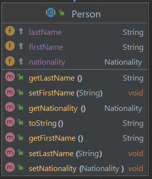

# Travel Oasis Project

In this project you will practice inheritance, creating and using enums, and creating and using custom exceptions. You will also use previous topics such as serialization, java docs and unit testing.

This program will provide a booking system for users to book a trip with the Travel Oasis travel agency. Users can create trips, add an agent for the trip and trip details, and add multiple guests per trip. They can even go back and edit an existing trip.

Trips are saved when the program closes, so that when the program boots back up all the previously created trips are still in the system.

## Project Instructions

[Follow the general instructions here for forking, cloning, and turning in assignment](https://ihccjavaii.github.io/docs/general-project-instructions/README.md)

You will have twelve files total in this project:

     - TravelOasisProgram (main)
       - Trip
       - Person (super class)
          - Agent (sub class)
          - Guest (sub class)
       - Nationality (Enum)
       - Three custom Exceptions classes (your choice)
       - AgentTests
       - GuestTests
       - TripTests


### Nationality Enum
    1. Create an enum called Nationality that includes at least five country codes of your choosing
    2. Country codes should translate to the countries spelled out name. For example, US would be the code and United States would be the value.

Example class diagram. You get to choose your own country codes.


### Person class
    1. Person should be declared an abstract class
    2. Create all the fields and methods shown in the example class diagram below 



### Agent class
    1. Agent should inherit from Person
    2. Create all the fields and methods shown in the example class diagram below
    3. Perform validation in the setters
    4. yearlyBonus is calculated using the number of trips booked * 0.2% of their salary


### Guest class
    1. Guest should inherit from Person
    2. Create all the fields and methods shown in the example class diagram below
    3. Perform validation in the setters


### Trip class
    1. Create the Trip class based on the example class diagram below.
    2. Add validations to the setters. 
    3. Validate that the trip end date must be after the trip start date, and that the trip start date cannot be before the current date (hint: use `Date` class)


### Three custom exception
    1. Create a new package for your exceptions
    2. Create three exception classes that extend the appropriate Exception class in Java
    3. Throw these exceptions in an appropriate place in your program. Examples include validation in setters, validation for inputs, etc

### TravelOasisProgram class
This will be the main class that runs the program. You will need to build:

    1. A menu system that prompts the user to add a trip, edit a trip, display all trips (sorted by start date), or close the program.
    2. Prompts for all necessary input to create a `Trip`, an `Agent` and as many `Guests` as the user wants per trip.
    3. Validate user input where necessary.
    4. New `Trips` created are added to an `ArrayList`.
    5. Program deserializes list of `Trips` on startup, and serializes updated list on shut down.


### Javadocs
    1. Add Javadoc comments to the `Trip`, `Person`, `Agent`, and `Guest` classes

### Unit Testing
    1. Create unit test classes for the `Agent`, `Guest` and `Trip` classes. Aim for at least 90% test coverage of those classes.

[A reminder of how to setup JUnit is here](https://ihccjavaii.github.io/docs/junit/junit-setup-instructions.html)

### Example output

Here's an example of the program running. It does not show all the options, and you do not need to use the same wording for prompts. Use this as a general idea of how the program will run.

```
Deserializing file
File read!

Welcome to Travel Oasis. How can I help?

'add' to add a trip
'edit' to edit any part of an existing trip
'display' to see all trips
'end' to leave the program

add

Enter the agent's first name: 
Bob

Enter the agents's last name: 
Smith

Enter the guest's nationality
Dutch

Enter the agent's phone number in 999-999-9999 format: 
12323

Phone number 12323 was not written in valid 999-999-9999 format
Enter the agent's phone number in 999-999-9999 format: 
123-456-7890

Enter the agents salary 
40000

Enter the guest's first name: 
Jimmy

Enter the guest's last name: 
Donaldson

Enter the guest's nationality
Finnish

Does guest have meal plan?
enter 'yes'(y) or 'no'(n)
y

Has the guest paid?
enter 'yes'(y) or 'no'(n)
y

Do you want to enter another guest? Enter 'y' or 'n'
n

Enter the total cost for the trip: 
1000000

Enter the trips start date in MM-DD-YYYY format: 
04-18-2024

Enter the trips end date in MM-DD-YYYY format: 
04-20-2024

Trip added!

Welcome to Travel Oasis. How can I help?

'add' to add a trip
'edit' to edit any part of an existing trip
'display' to see all trips
'end' to leave the program

display

       Trip 1
----------------------
Agent Information:
Name: bill nye
Nationality: Swedish
Agent Phone Number: 111-111-1111
Agent Salary: 4000.0

Guests Information:
Name: john smith
Nationality: Finnish
Payment Status: paid
Meal Plan Selected: no

Trip cost: 3000.0
Trip Start: 2024-01-12
Trip End: 2024-01-30

       Trip 2
----------------------
Agent Information:
Name: joe smith
Nationality: Swedish
Agent Phone Number: 111-111-1111
Agent Salary: 300000.0

Guests Information:
Name: jem last
Nationality: Finnish
Payment Status: paid
Meal Plan Selected: no

Trip cost: 9000.0
Trip Start: 2023-12-01
Trip End: 2023-12-13

       Trip 3
----------------------
Agent Information:
Name: Bob Smith
Nationality: Dutch
Agent Phone Number: 123-456-7890
Agent Salary: 40000.0

Guests Information:
Name: Jimmy Donaldson
Nationality: Finnish
Payment Status: paid
Meal Plan Selected: yes

Trip cost: 1000000.0
Trip Start: 2024-04-18
Trip End: 2024-04-20

Welcome to Travel Oasis. How can I help?

'add' to add a trip
'edit' to edit any part of an existing trip
'display' to see all trips
'end' to leave the program

end

Serializing file
File saved!
```

### Rubric

Projects are graded on functionality (does it compile, can the user do what they are supposed to, and do they get the expected results). It is also graded on features added in the instructions, like including the correct methods, constructors, data conversions, and tests.

| Topic                        | Task                                                                                                                                                     | Points |
|------------------------------|----------------------------------------------------------------------------------------------------------------------------------------------------------|--------|
| **Nationality Enum**         | Class created is an Enum and includes several country codes with country names spelled out as value                                                      | 5      |
|                              | Class is not an enum and/or not working correctly                                                                                                        | 2      |
|                              | Enum is missing                                                                                                                                          | 0      |
| **Person Class**             | Person class is abstract and includes all required methods and fields.                                                                                   | 5      |
|                              | Person class not abstract or missing fields                                                                                                              | 0      |
| **Agent class**              | Agent class extends person and includes all required methods and fields.                                                                                 | 5      |
|                              | Agent class does not extend person or is missing fields.                                                                                                 | 0      |
| **Guest class**              | Guest class extends person and includes all required methods and fields.                                                                                 | 5      |
|                              | Guest class does not extend person or is missing fields.                                                                                                 | 0      |
| **Trip class**               | Trip class does not extend any other class, and includes all required methods and fields                                                                 | 5      |
|                              | Trip class missing required methods/fields and/or used incorrectly                                                                                       | 0      |
| **Custom Exceptions**        | Three custom exceptions are created that extend an existing Java exception. Exceptions are thrown in appropriate areas inside the program.               | 5      |
|                              | Less than three exceptions created or exceptions incorrectly created and used                                                                            | 2      |
|                              | Custom exceptions missing                                                                                                                                | 0      |
| **TravelOasisProgram class** | Program allows user to add, edit, and display trips. Prompts for all required fields. Can add multiple trips. Serializes and deserializes appropriately. | 5      |
|                              | Includes only some of the required features and/or features that do not work.                                                                            | 2      |
|                              | Does not compile or missing most functionalities.                                                                                                        | 0      |
| **Javadocs**                 | Javadocs created for Trip, Person, Agent and Guest classes and methods                                                                                   | 2      |
|                              | Javadocs on some but not all required places                                                                                                             | 1      |
|                              | Javadocs missing                                                                                                                                         | 0      |
| **JUnit tests**              | JUnit tests created for Agent, Guest and Trip classes with at least 90% line coverage                                                                    | 5      |
|                              | JUnit tests created but line coverage below 90%                                                                                                          | 2      |
|                              | JUnit tests missing                                                                                                                                      | 0      |
| **Total**                    |                                                                                                                                                          | 42     |


